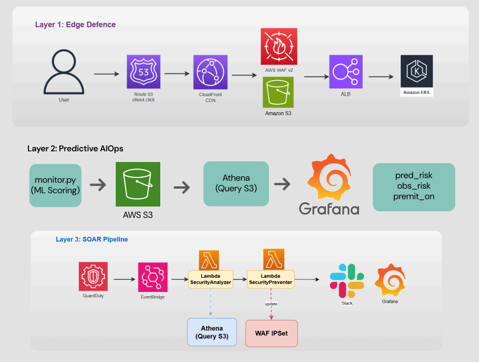
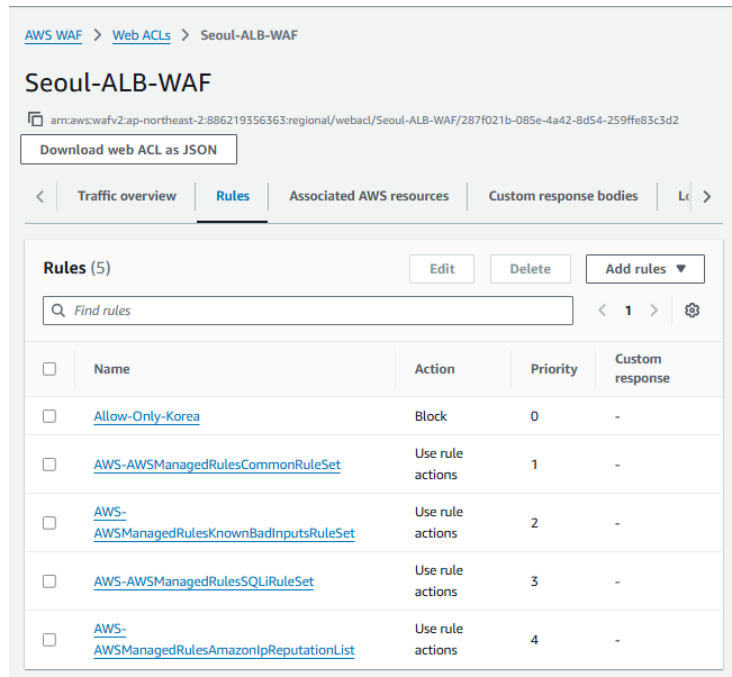
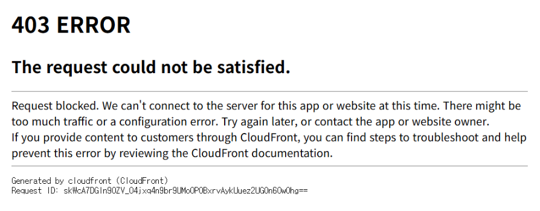
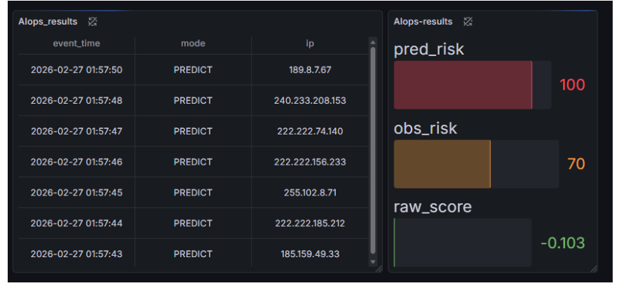
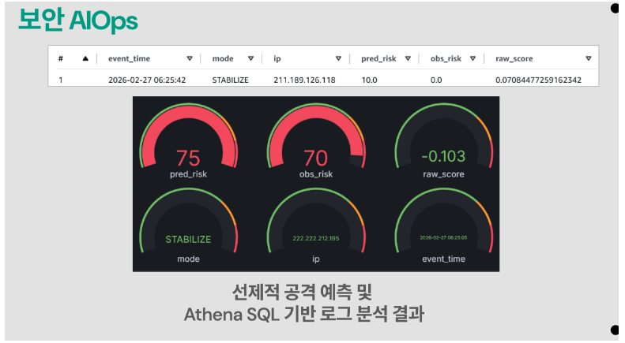
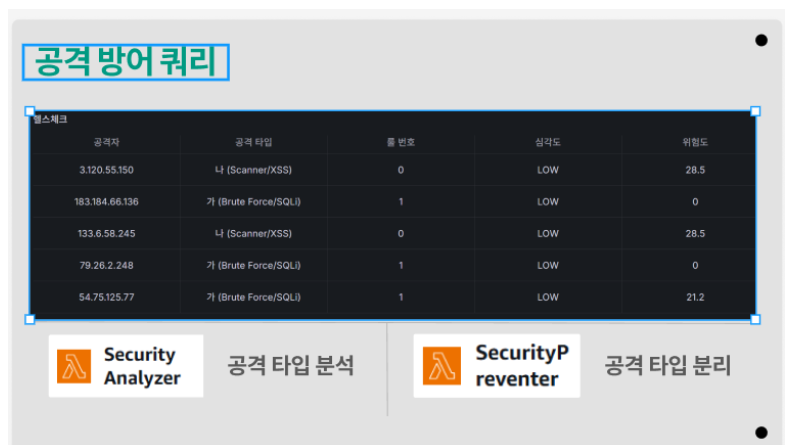
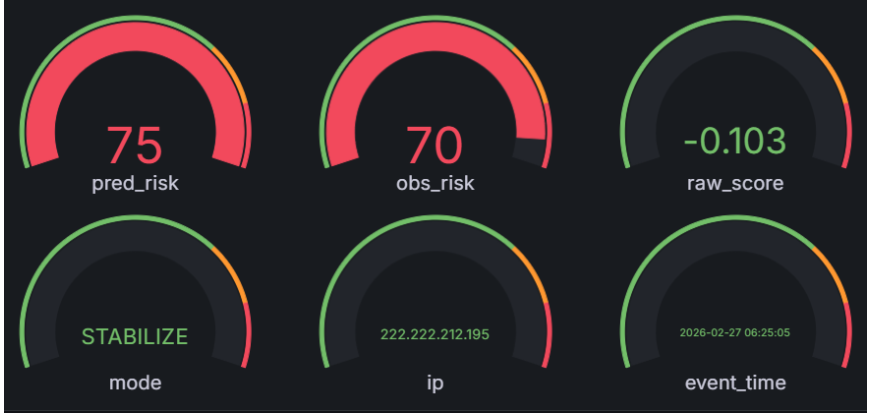

# AWS 3-Layer Security AIOps Platform

> 상세 내용 및 전체 코드: [GitHub README](https://github.com/minju2022039105/Security-AIOps-IsolationForest) · [Velog 시리즈](https://velog.io/@yapp/series/AIOps-%EB%B3%B4%EC%95%88-%ED%94%84%EB%A1%9C%EC%A0%9D%ED%8A%B8)

> CloudFront·WAF 엣지 방어 → Isolation Forest 60초 선행 탐지 → SOAR 자동 대응으로 이어지는 완전 자동화 보안 플랫폼  
> 6인 팀 | 보안 파트 단독 담당 | 클라우드웨이브 7기 부트캠프 (2026.02)

---

## 1. Project Overview

| 역할 | 구성 |
| :--- | :--- |
| **사전 차단** | CloudFront Origin Cloaking + AWS WAF v2 (Priority 5단계) |
| **이상 탐지** | Isolation Forest 비지도 학습 — 60초 선행 탐지 |
| **자동 대응** | GuardDuty → EventBridge → Lambda SOAR (WAF IPSet 자동 갱신) |
| **운영 관제** | S3 → Athena → Grafana (LGP Stack) |

---

## 2. Design Decisions

### 왜 이 프로젝트를 시작했는가

이커머스 플랫폼은 프로모션 기간에 정상 트래픽과 악성 트래픽이 동시에 폭증합니다. 두 가지 현실적 제약이 설계를 결정했습니다.

- **예산 제약**: 부트캠프 크레딧 $1,200 안에서 EKS를 운영해야 했고, 악성 트래픽이 클러스터 내부까지 유입되면 컴퓨팅 비용이 증가하는 구조였습니다.
- **레이블 부재**: 실운영 보안 로그는 대부분 미분류 — 지도 학습 기반 모델 구축이 불가능했습니다.

이 두 제약을 동시에 해결하기 위해 세 가지 설계 원칙을 수립했습니다: **앞단 차단(비용 최소화)**, **비지도 탐지(레이블 없는 이상 감지)**, **완전 자동화(24/7 무인 대응)**.

### 핵심 설계 결정

**Why Edge-First?**
WAF가 공격을 차단하면 요청은 EKS까지 도달하지 않습니다. EKS는 Node 수에 비례해 시간당 과금되므로, 악성 트래픽이 오토스케일링을 유발하기 전에 엣지에서 제거하는 것이 비용과 가용성을 동시에 지키는 핵심 전략이었습니다.

**Why Isolation Forest?**
보안 로그는 정상 트래픽이 99% 이상, 공격 샘플은 극소수입니다. 레이블 없이 정상 패턴을 학습하고 그 패턴에서 벗어난 트래픽을 이상으로 분류하는 비지도 학습이 유일한 현실적 선택이었습니다.

**Why Dynamic Threshold?**
고정 임계값(`risk > 80`)은 트래픽 패턴이 변하면 오탐이 급증합니다. 전체 위험 점수 분포의 하위 5%를 동적 임계값으로 설정해 실시간 트래픽에 자동 적응하도록 설계했습니다.

```python
threshold = np.percentile(scores_all, 5)
```

**Why LGP Stack (not OpenSearch)?**
OpenSearch는 전용 클러스터 운영 비용이 높고 서버리스 연동이 제한적입니다. Grafana 하나로 CloudWatch 메트릭 + Athena 로그 + ML 스코어를 단일 화면에 통합하는 LGP Stack이 비용과 통합성 모두에서 적합했습니다.

---

## 3. Key Achievements

- 공격 탐지를 실제 피해 발생 **60초 전**에 선행 수행 — Pre-Mitigation 모드 자동 활성화
- GuardDuty → Lambda 자동 차단 구조로 **탐지~차단 46ms** 달성
- 동적 임계값 적용으로 트래픽 패턴 변화에도 오탐 자동 제어
- SQLi, Log4j, 해외 IP 차단 검증 완료 — **유효 차단 로그 8건** 확보
- OpenSearch 대비 인프라 운영 비용 **80% 이상 절감** (LGP Stack)

---

## 4. Architecture



전체 보안 파이프라인은 **차단 → 탐지 → 대응 → 시각화**의 폐루프 구조입니다. 각 계층은 S3 데이터 레이크를 공유 인터페이스로 연결되며, 차단된 공격 패턴이 모델 피드백으로 재투입되는 선순환 구조를 형성합니다.

---

## 5. Layer 1: Edge Defense

악성 트래픽이 EKS 클러스터 근처까지 오기 전에 엣지에서 먼저 차단합니다.

```
Route53 → CloudFront (Origin Cloaking) → WAF v2 → ALB → EKS
```

- **CloudFront**: Origin Cloaking으로 EKS 실제 IP 외부 노출 차단, DDoS 공격 표면 감소
- **Security Group**: ALB 포트 외 전체 폐쇄 — Default Deny L4 방어선 (추가 비용 없음)

**WAF 우선순위 설계:**

| Priority | 규칙 | 목적 |
| :---: | :--- | :--- |
| 0 | Allow-Only-Korea | 해외 트래픽 1차 차단 |
| 1 | AWSManagedRulesCommonRuleSet | OWASP Top 10 방어 |
| 2 | AWSManagedRulesSQLiRuleSet | SQL Injection 특화 차단 |
| 3 | AWSManagedRulesKnownBadInputsRuleSet | Log4j, JNDI 차단 |
| 4 | IP Reputation List (동적) | Lambda가 실시간 갱신하는 블랙리스트 |





---

## 6. Layer 2: Predictive AIOps — 60초 선행 탐지

공격자는 실제 공격 전 반드시 **스캐닝 → 취약점 탐색 → 반복 테스트** 사전 정찰을 수행합니다. 이 정찰 단계에서 발생하는 미세한 이상 패턴을 ML 모델이 탐지해 실제 공격 도달 약 60초 전에 대응 시간을 확보합니다.

```python
LEAD_SECONDS = 60  # 선행 탐지 윈도우
```

**피처 설계:**

| 피처 | 공격 신호 |
| :--- | :--- |
| `country_code` | 평소 없던 국가에서의 접근 = 스캐닝 초기 신호 |
| `rule_code` | 공격 패턴 발생 빈도 정량화 |
| `uri_len` | 비정상적으로 긴 URI = SQLi 페이로드 삽입 징후 |

**Pre-Mitigation 시스템:** 예측 위험도가 70점을 초과하면 실제 공격 확인 전에 방어 레벨을 선제적으로 상승시킵니다.

```python
if pred_risk > 70:
    premit_on = True
```





---

## 7. Layer 3: SOAR 자동 대응

GuardDuty 위협 탐지와 ML 예측 결과를 결합해 운영자 개입 없이 24/7 자동 차단합니다.

```
GuardDuty (위협 탐지)
    ↓
EventBridge (이벤트 필터링)
    ↓
SNS (Slack·Email·Lambda 동시 전달)
    ↓
Analyzer Lambda → Athena 조회 → 공격 IP·타입·ML 위험도 종합 판단
    ↓
Preventer Lambda → WAF IPSet 업데이트 (탐지~차단 46ms)
```

WAF IPSet 업데이트 시 동시 요청 충돌 방지를 위해 **Lock Token** 방식으로 동시성을 제어했습니다.





---

## 8. 검증 결과

| 시나리오 | 결과 |
| :--- | :---: |
| SQL Injection 페이로드 | **403 Forbidden** |
| Log4j / JNDI Injection | **403 Forbidden** |
| 해외 IP 접근 (네덜란드·미국) | **403 Forbidden** |
| GuardDuty 탐지 → Lambda 자동 차단 | **WAF IPSet 자동 갱신** |

- Athena 기반 로그 분석으로 유효 차단 로그 **8건** 확보
- `pred_risk` 75.0 측정 시 Pre-Mitigation 모드 정상 활성화 확인

---

## 9. 주요 트러블슈팅

**WAF IPSet 생성 실패 (ValidationException)**
AWS API 특정 필드에 한글 문자열 포함 시 거부. `Description` 필드를 영문으로 변경해 해결.

**Athena CLI 옵션 인식 불가**
AWS CLI v2에서 `--query-config`가 `--result-configuration`으로 변경됨. 버전별 옵션 차이 확인 후 수정.

---

## 10. Tech Stack

| 분류 | 기술 |
| :--- | :--- |
| **보안 / 탐지** | AWS WAF v2, GuardDuty, CloudFront |
| **SOAR / 자동화** | EventBridge, AWS Lambda (Python), SNS |
| **AI/ML** | Isolation Forest (Scikit-learn) |
| **로그 분석** | S3, Athena, Grafana Cloud |
| **컨테이너** | EKS, ALB |

---

**프로젝트 기간**: 2026.02 (3주)  
**역할**: 보안 파트 단독 담당 (6인 팀)
